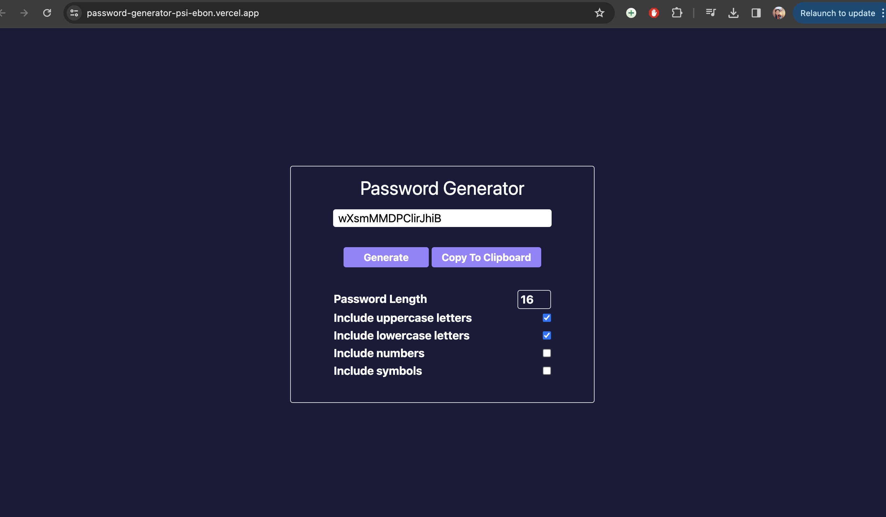
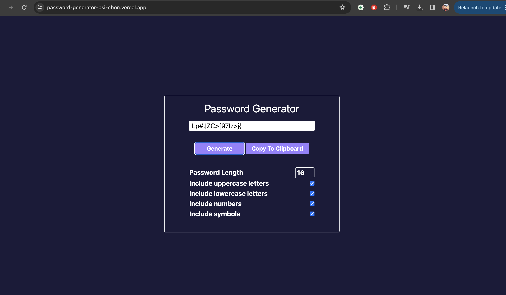
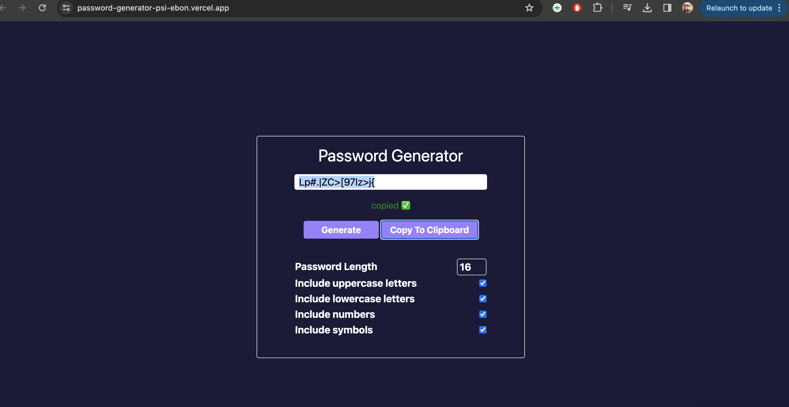

# Password Generator

[View my Live Application Here](https://password-generator-psi-ebon.vercel.app/)

## Overview

This password generator allows users to create secure, random passwords based on selected criteria. The web application is built with HTML, Tailwind CSS for styling, and JavaScript for functionality. It's designed to be simple yet effective, providing users with the ability to customize their password's complexity through options such as length, inclusion of uppercase and lowercase letters, numbers, and special symbols.

## Features

- **Random Password Generation**: Generates a secure password based on user-selected criteria.
- **Customizable Length**: Users can choose the length of the password between 4 and 20 characters.
- **Character Type Selection**: Options to include uppercase letters, lowercase letters, numbers, and symbols.
- **Clipboard Functionality**: Allows users to copy the generated password directly to the clipboard with one click.
- **Real-time Error Handling**: Provides feedback if the selected options are not within the required parameters.

## Technologies Used

- **HTML**: Structures the web page and its content.
- **Tailwind CSS**: Provides styling to make the UI intuitive and visually appealing.
- **JavaScript**: Powers the logic for generating passwords and handling user interactions.

## How to Use

### Prerequisites

You need a modern web browser that supports HTML5, CSS3, and JavaScript.

### Running the Application

1. **Download the Project**: Clone the repository or download the files to your local machine.
2. **Open `index.html`**: Use any web browser to open the `index.html` file.
3. **Set Password Preferences**:
   - **Password Length**: Adjust the desired length of the password using the number input.
   - **Character Inclusion**: Check or uncheck the boxes to include uppercase letters, lowercase letters, numbers, and symbols.
4. **Generate Password**: Click on the "Generate" button to create a new password based on the selected criteria.
5. **Copy Password**: Use the "Copy To Clipboard" button to copy the password for use.

## Code Explanation

### HTML Structure

- The main interface is built using a flex container that centers the password generator tools both vertically and horizontally.
- Input controls include checkboxes and a number input to set preferences for the password generator.

### JavaScript Functions

- **`generatePassword(length, useLowercase, useUppercase, useNumbers, useSpecialChars)`**: Main function to generate the password. It constructs a character set based on the selected options and randomly picks characters until the desired length is reached.
- **`getRandomChar(charSet)`**: Helper function that returns a random character from a given string of characters.

### Styling with Tailwind CSS

- Tailwind CSS is used for quick and responsive styling. Classes control layout, spacing, sizing, and colors across the application.

## Project Structure

```
/password-generator
|-- index.html         # Main HTML file for the project
|-- script.js          # Contains JavaScript for password generation logic
|-- readme.md          # Documentation file
```

## Screenshots





## Contributing

Contributions to this project are welcome. Please fork the repository and submit a pull request.

## License

This project is open source and available under the [MIT License](LICENSE).
